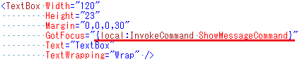

# MarkupExtensionsForEvents

## Project Description
このプロジェクトは、WPF4.5で導入された新機能、「イベントのマークアップ拡張」のサンプルです。  
This is sample project for explaining the WPF4.5's new feature 'Markup Extensions for events'.

## 概要
このサンプルでは、WPF4.5で追加された新機能「イベントのマークアップ拡張」を用いて、InvokeCommadというマークアップ拡張を作っています。  
このマークアップ拡張を用いることで、「任意のコントロールのイベント発生時にVMのコマンドを呼ぶ」という動作を、以下のようなシンプルなXAMLで記述することができます。

## 使い方

1. InvokeCommandExtension.csをプロジェクトに追加する
2. 名前空間の設定をする
3. InvokeCommandマークアップ拡張を使うことで、任意のコントロールのイベントとVMのコマンドを結び付けることができます。

## Link
+ WPF4.5の新機能
http://msdn.microsoft.com/ja-jp/library/bb613588%28v=vs.110%29.aspx#events_markup_extenions

+ XAML Advent Calendar 2014
http://qiita.com/advent-calendar/2014/xaml
